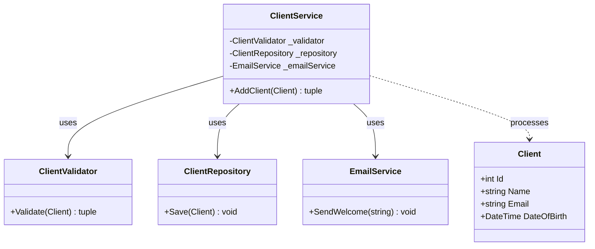
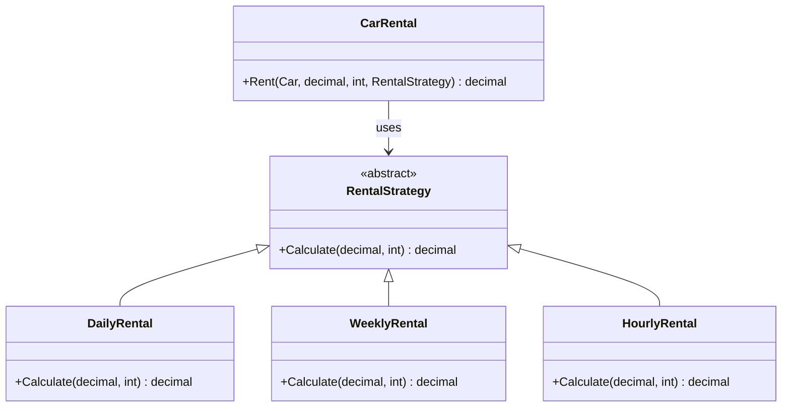
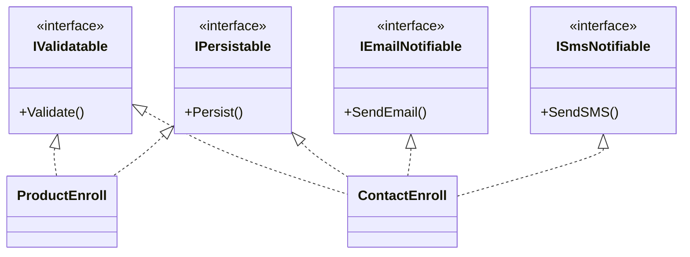
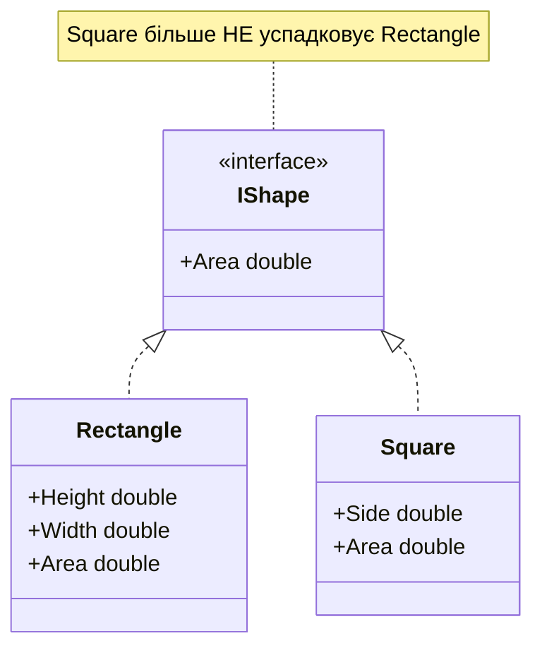

# 🧩 Лабораторна робота №1 — Принципи SOLID

> [!abstract] 📋 Метадані
> **Курс**: Об'єктно-орієнтований аналіз та конструювання програмних систем
> **Семестр**: 2 (2025/26)
> **Студент**: Степаненко Назар Юрійович, ТВ-43
> **Дедлайн**: 24 лютого 2026 ✅
> **Мова реалізації**: C# (.NET 9)
> **Код**: [LR1.md у University-Repository](../../../University-Repository/Year-2/Semester-2/OOA/LR/LR1.md)

## 🎯 Мета роботи

Проаналізувати **5 фрагментів коду** на C#, виявити порушення принципів **SOLID**, обґрунтувати порушення та реорганізувати код з дотриманням принципів. Код можна розділяти по різних файлах.

> [!info] Результат
> Виявлено та виправлено ==4 порушення==: **SRP**, **OCP**, **ISP**, **LSP**. Фрагмент №2 виявився ілюстрацією правильного коду (вже містив виправлення першого випадку).

---

## 🗺 Швидка карта порушень

| № | Принцип | Клас-злочинець | Спосіб виправлення |
|:-:|:-:|---|---|
| 1 | **S**RP | `Client.Add()` | Розділення на 4 класи + оркестратор |
| 2 | ✅ ОК | (приклад правильної архітектури) | — |
| 3 | **O**CP | `CarRental.Rent()` | Strategy patrern |
| 4 | **I**SP | `IEnroll` | Розділення на 4 інтерфейси |
| 5 | **L**SP | `Square : Rectangle` | Спільний інтерфейс `IShape` |

---

## ⚙️ Завдання 1 — Порушення SRP

> [!quote] 📖 Принцип єдиної відповідальності (Single Responsibility)
> Клас повинен мати **лише одну причину для зміни**. Кожен клас має відповідати лише за одну частину функціональності.
>
> 🔑 Ключове поняття: **cohesion** (зв'язність). Чим вища зв'язність — тим краще дотримано SRP.

### ❌ Вихідний код із порушенням

> [!failure]- Клас `Client` робить ОДНОЧАСНО **4 різні речі**
> 1. Зберігає дані моделі
> 2. ==Валідує== вхідні дані
> 3. ==Зберігає== запис у БД через SQL
> 4. ==Надсилає== email через SMTP

```csharp
public class Client
{
    public int Id { get; set; }
    public string Name { get; set; }
    public string Email { get; set; }
    public DateTime DateOfBirth { get; set; }

    public (bool status, string errorMessage) Add()
    {
        // 🔴 ВІДПОВІДАЛЬНІСТЬ 1: Валідація
        if (string.IsNullOrEmpty(this.Name))
            return (false, "Name is invalid");
        if (!this.Email.Contains("@"))
            return (false, "Email is invalid");
        if (DateOfBirth > DateTime.Now)
            return (false, "Date of Birth is invalid");

        // 🔴 ВІДПОВІДАЛЬНІСТЬ 2: Збереження у БД
        using (var cn = new SqlConnection("cnString"))
        {
            var cmd = new SqlCommand(
                "INSERT INTO clients(Name, Email, DateOfBirth) " +
                "VALUES(@Name, @Email, @DateOfBirth)", cn);
            cmd.Parameters.AddWithValue("Name", this.Name);
            cmd.Parameters.AddWithValue("Email", this.Email);
            cmd.Parameters.AddWithValue("DateOfBirth", this.DateOfBirth);
            cmd.ExecuteNonQuery();
        }

        // 🔴 ВІДПОВІДАЛЬНІСТЬ 3: Email
        var mail = new MailMessage("no-reply@system.net", this.Email);
        var smtp = new SmtpClient { Port = 25, Host = "smtp.system.net" };
        mail.Subject = "[System.NET] Welcome";
        mail.Body = "Congrats!";
        smtp.Send(mail);

        return (true, string.Empty);
    }
}
```

> [!warning] 🔍 Чому це порушення SRP
> Якщо зміниться:
> - Логіка валідації → потрібно правити `Client`
> - Спосіб збереження → потрібно правити `Client`
> - SMTP-сервер → потрібно правити `Client`
> - Бізнес-правила email → потрібно правити `Client`
>
> ==4 причини для зміни одного класу — гарантоване порушення.==

### ✅ Виправлений код

> [!success]+ Розділення на 5 класів за відповідальностями
> Кожен клас має **одну причину для зміни**.



```csharp
// 📦 Модель — лише дані
public class Client
{
    public int Id { get; set; }
    public string Name { get; set; }
    public string Email { get; set; }
    public DateTime DateOfBirth { get; set; }
}

// 🔍 Валідація
public class ClientValidator
{
    public (bool isValid, string error) Validate(Client client)
    {
        if (string.IsNullOrEmpty(client.Name))         return (false, "Name is invalid");
        if (!client.Email.Contains("@"))               return (false, "Email is invalid");
        if (client.DateOfBirth > DateTime.Now)         return (false, "DOB is invalid");
        return (true, string.Empty);
    }
}

// 💾 Доступ до БД
public class ClientRepository
{
    public void Save(Client client) { /* SQL INSERT */ }
}

// 📧 Email
public class EmailService
{
    public void SendWelcome(string email) { /* SMTP send */ }
}

// 🎭 Оркестрація (теж єдина відповідальність!)
public class ClientService
{
    private readonly ClientValidator _validator = new();
    private readonly ClientRepository _repository = new();
    private readonly EmailService _emailService = new();

    public (bool, string) AddClient(Client client)
    {
        var (isValid, error) = _validator.Validate(client);
        if (!isValid) return (false, error);

        _repository.Save(client);
        _emailService.SendWelcome(client.Email);
        return (true, string.Empty);
    }
}
```

> [!tip] 💡 Чому це краще
> - Зміна SMTP не торкається моделі `Client`.
> - Можна **тестувати кожен клас окремо** (наприклад, валідатор без БД і пошти).
> - Можна підмінити `ClientRepository` на mock для unit-тестів.
> - Якщо завтра з'явиться `SmsService` — додаємо як ще одну залежність у `ClientService`, нічого більше не міняючи.

---

## ✅ Завдання 2 — Приклад правильної архітектури

> [!info] Цей фрагмент — НЕ порушення
> Завдання №2 у документі — це фактично ==правильна реалізація== того, що в завданні №1 було неправильно. Тут уже видно `Client + ClientRepository + ClientService + EmailHelper`. Я зарахував його як ілюстративний appendix до завдання №1.

---

## ⚙️ Завдання 3 — Порушення OCP

> [!quote] 📖 Принцип відкритості/закритості (Open/Closed)
> Програмні сутності повинні бути **відкритими для розширення, але закритими для модифікації**.

### ❌ Вихідний код із порушенням

```csharp
public enum RentType { Daily, Weekly }

public class CarRental
{
    public decimal Rent(Car car, decimal baseValue, int amount, RentType rentType)
    {
        if (rentType == RentType.Daily)                 // 🔴 if на тип
            return baseValue * amount;
        if (rentType == RentType.Weekly)                // 🔴 ще один if на тип
            return baseValue * (7 * amount);
        return 0;
    }
}
```

> [!failure] 🔍 Симптом OCP-порушення
> Додавання нового типу оренди (Hourly, Monthly, Yearly) вимагає ==редагування методу `Rent()`==. Тобто **модифікації вже працюючого коду**. Це порушує OCP.

### ✅ Виправлений код — Strategy pattern



```csharp
// Базова стратегія
public abstract class RentalStrategy
{
    public abstract decimal Calculate(decimal baseValue, int amount);
}

public class DailyRental  : RentalStrategy
{
    public override decimal Calculate(decimal baseValue, int amount)
        => baseValue * amount;
}

public class WeeklyRental : RentalStrategy
{
    public override decimal Calculate(decimal baseValue, int amount)
        => baseValue * 7 * amount;
}

// ✨ Додавання нового типу — БЕЗ зміни існуючого коду
public class HourlyRental : RentalStrategy
{
    public override decimal Calculate(decimal baseValue, int amount)
        => baseValue / 24 * amount;
}

public class CarRental
{
    public decimal Rent(Car car, decimal baseValue, int amount, RentalStrategy strategy)
        => strategy.Calculate(baseValue, amount);
}
```

> [!tip] 🎓 Принцип у дії
> Тепер `CarRental` ==закритий для модифікації== (його `Rent()` не змінюється), але ==відкритий для розширення== (нові `RentalStrategy` підкласи додаються без проблем).

---

## ⚙️ Завдання 4 — Порушення ISP

> [!quote] 📖 Принцип розділення інтерфейсів (Interface Segregation)
> Клієнти **не повинні залежати від методів, якими не користуються**. Краще кілька малих спеціалізованих інтерфейсів, ніж один великий.

### ❌ Вихідний код із порушенням

```csharp
public interface IEnroll
{
    void Validate();
    void Persist();
    void SendEmail();
    void SendSMS();
}

class ProductEnroll : IEnroll
{
    public void Validate()  { /* check */ }
    public void Persist()   { /* save */ }
    public void SendEmail() => throw new NotImplementedException("Product don't have e-mail!");  // 🚨
    public void SendSMS()   => throw new NotImplementedException("Product don't have phone!");   // 🚨
}

class ContactEnroll : IEnroll
{
    public void Validate()  { /* check */ }
    public void Persist()   { /* save */ }
    public void SendEmail() { /* OK */ }
    public void SendSMS()   { /* OK */ }
}
```

> [!failure] 🔍 Сигнал порушення ISP
> ==`NotImplementedException` — це прямий індикатор==. Інтерфейс змушує клас реалізовувати методи, які йому не потрібні.

### ✅ Виправлений код — 4 спеціалізовані інтерфейси



```csharp
public interface IValidatable     { void Validate(); }
public interface IPersistable     { void Persist(); }
public interface IEmailNotifiable { void SendEmail(); }
public interface ISmsNotifiable   { void SendSMS(); }

class ProductEnroll : IValidatable, IPersistable
{
    public void Validate() { }
    public void Persist()  { }
}

class ContactEnroll : IValidatable, IPersistable, IEmailNotifiable, ISmsNotifiable
{
    public void Validate()  { }
    public void Persist()   { }
    public void SendEmail() { }
    public void SendSMS()   { }
}
```

> [!success] 🎓 Результат
> `ProductEnroll` **не змушений** реалізовувати методи нотифікації, які йому не потрібні. Жодних `NotImplementedException`. Клас бере на себе **рівно стільки відповідальностей, скільки реально йому потрібно**.

---

## ⚙️ Завдання 5 — Порушення LSP

> [!quote] 📖 Принцип підстановки Лісков (Liskov Substitution)
> Об'єкти підкласу повинні бути **замінними на об'єкти базового класу без порушення коректності програми**.
>
> 🎓 **Оригінал (Barbara Liskov, 1988)**: якщо для кожного об'єкта `o₁` типу `S` існує об'єкт `o₂` типу `T`, такий, що з будь-якої програми `P`, визначеної в термінах `T`, поведінка `P` не змінюється при заміні `o₂` на `o₁` — то `S` є підтипом `T`.

### ❌ Вихідний код із порушенням

> [!failure] Класичний приклад "Square — це Rectangle?"
> У реальному житті — так, квадрат це окремий випадок прямокутника. **У ООП — НІ**, бо у Rectangle висота і ширина незалежні, а у Square — пов'язані.

```csharp
public class Rectangle
{
    public virtual double Height { get; set; }
    public virtual double Width  { get; set; }
    public double Area => this.Height * this.Width;
}

class Square : Rectangle
{
    public override double Height { set => base.Width = base.Height = value; }
    public override double Width  { set => base.Width = base.Height = value; }
}

public class Execution
{
    public Execution()
    {
        var r = new Rectangle() { Height = 10, Width = 5 };
        GetRectArea(r);                                  // ✅ 50

        var s = new Square() {
            Height = 10,    // стає 10
            Width  = 5      // ⚠ обидва стають 5!
        };
        GetRectArea(s);                                  // ❌ очікувалось 50, отримали 25
    }

    public double GetRectArea(Rectangle rect) => rect.Area;
}
```

> [!warning] 🔍 Аналіз
> `GetRectArea(Rectangle rect)` отримує об'єкт типу `Rectangle`. Він **не знає**, що насправді це `Square`. При підстановці поведінка ==змінюється непередбачувано==: площа стає 25 замість 50. Контракт базового класу зламано.

### ✅ Виправлений код — спільний інтерфейс `IShape`



```csharp
public interface IShape
{
    double Area { get; }
}

public class Rectangle : IShape
{
    public double Height { get; set; }
    public double Width  { get; set; }
    public double Area => Height * Width;
}

public class Square : IShape
{
    public double Side { get; set; }
    public double Area => Side * Side;
}

public class Execution
{
    public Execution()
    {
        var r = new Rectangle { Height = 10, Width = 5 };
        PrintArea(r);                            // ✅ 50

        var s = new Square { Side = 5 };
        PrintArea(s);                            // ✅ 25 — і це правильно
    }

    public double PrintArea(IShape shape) => shape.Area;
}
```

> [!tip] 🎓 Чому тепер усе працює
> `Square` **не успадковує** `Rectangle` — отже **не може зламати** його контракт. Обидва класи реалізують `IShape` із чітко визначеною семантикою: "у тебе є площа". Як саме обчислюється — деталь реалізації.

---

## 📊 Підсумкова таблиця

| Принцип | Симптом порушення | Спосіб виправлення | Патерн, що допоміг |
|---|---|---|---|
| **SRP** | Клас робить декілька речей; "And" у назві | Розділити на класи за відповідальностями | Композиція через DI |
| **OCP** | `switch` чи `if` за типом | Поліморфізм + базовий інтерфейс | **Strategy** |
| **LSP** | Підклас порушує контракт батька | Заміна успадкування на інтерфейс | — |
| **ISP** | `NotImplementedException` у реалізації | Розділення великого інтерфейсу | — |
| **DIP** | Прямі залежності від конкретних класів | Інверсія через інтерфейс + DI | (не торкалось у ЛР1) |

---

## 🎯 Висновок

> [!success]+ Результат лабораторної
> - Проаналізовано **5 фрагментів коду** на C#.
> - Виявлено **4 реальних порушення** SOLID: SRP, OCP, ISP, LSP.
> - Запропоновано виправлення з обґрунтуванням.
> - У двох випадках застосовано класичні патерни: **Strategy** (для OCP) і **полиморфізм через інтерфейс** (для LSP).
>
> Дотримання SOLID гарантує:
> - ✅ Модульність — кожен клас має одну роль.
> - ✅ Розширюваність — нові типи додаються без зміни існуючого.
> - ✅ Тестованість — кожен компонент ізольовано тестується.
> - ✅ Супровід — зміна вимог торкається ==точково одного класу==.

---

> [!info] 🔗 Пов'язані матеріали
> - [[SOLID Принципи]] — детальний розбір принципів з прикладами
> - [[Теорія з лекцій]] — лекційна теорія з мапінгом до завдань
> - [[Захист Лабораторних]] — шпаргалка для усного захисту
> - [[ЛР2 — Породжувальні патерни|ЛР2 →]]
