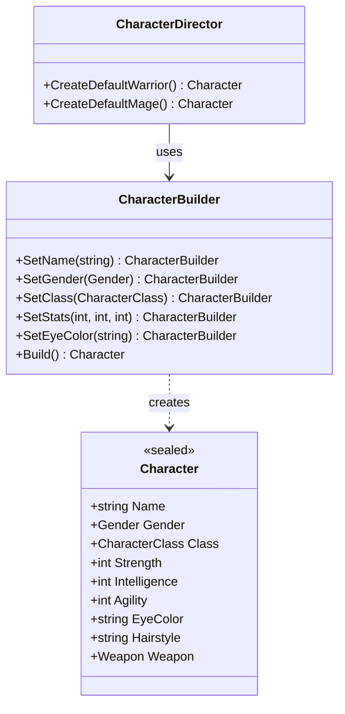
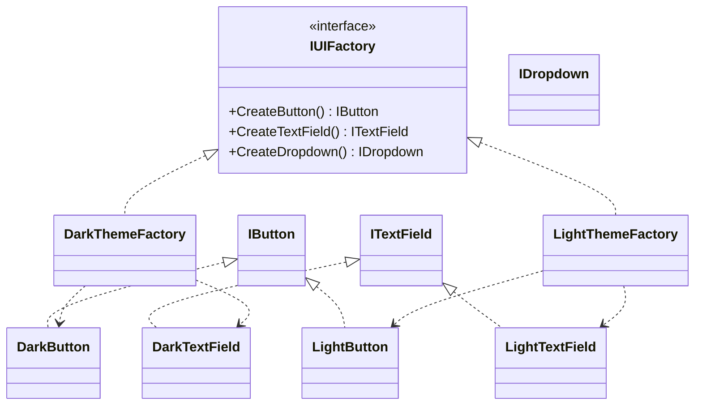
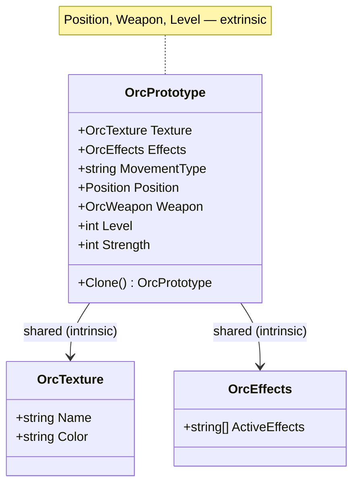
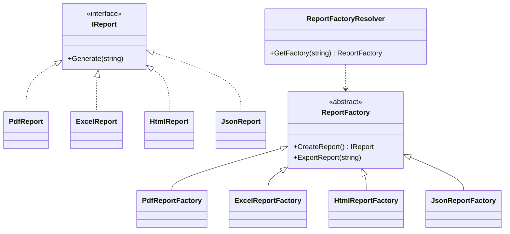

# 🏗 Лабораторна робота №2 — Породжувальні патерни

> [!abstract] 📋 Метадані
> **Курс**: Об'єктно-орієнтований аналіз та конструювання програмних систем
> **Семестр**: 2 (2025/26)
> **Студент**: Степаненко Назар Юрійович, ТВ-43
> **Дедлайн**: 17 березня 2026 ✅
> **Мова реалізації**: C# (.NET 9)
> **Кількість патернів**: ==5 з 5== (всі породжувальні з каталогу GoF)
> **Код**: `OOA/LR/LR2/CreationalPatterns/`

## 🎯 Мета роботи

Для **5 бізнес-сценаріїв** обрати та реалізувати відповідний породжувальний патерн проєктування, обґрунтувати вибір, продемонструвати роботу у консолі.

> [!info] Загальна ідея породжувальних патернів
> Породжувальні патерни ==абстрагують процес створення об'єктів==. Вони допомагають зробити систему незалежною від того, **як** її об'єкти створюються, компонуються та представляються.

---

## 🗺 Швидка карта

| № | Сценарій | Патерн | Файл |
|:-:|---|---|---|
| 1 | Створення персонажа гри | **Builder** | `BuilderPattern.cs` |
| 2 | UI-теми (темна / світла) | **Abstract Factory** | `AbstractFactoryPattern.cs` |
| 3 | Сервіс логування | **Singleton** | `SingletonPattern.cs` |
| 4 | Орки у грі-стратегії | **Prototype** | `PrototypePattern.cs` |
| 5 | Експорт звітів (PDF/Excel/HTML/JSON) | **Factory Method** | `FactoryMethodPattern.cs` |

---

## 🛠 Завдання 1 — Builder: Творець персонажа

> [!info] 📋 Сценарій
> Гра дозволяє створити персонажа з ==9 атрибутами==: ім'я, стать, клас (воїн/маг), сила/інтелект/спритність, колір очей, зачіска, зброя (меч/кинджал/лук). Потрібно і "стандартний боєць", і повна кастомізація.

### 🎯 Чому **Builder**

> [!tip] Три ознаки задачі, що вказують на Builder
> 1. ==Багато опціональних параметрів== — 9 полів, частина з розумними дефолтами.
> 2. Потрібні **пресети** (стандартний воїн, стандартний маг).
> 3. Потрібна **повна кастомізація** з довільною комбінацією параметрів.
>
> Альтернативи (відкинуто): конструктор з 9 параметрами — нечитабельний. Властивості з `set` — імутабельність втрачається.

### 📐 Структура



### 💡 Ключова ідея — fluent API

```csharp
var custom = new CharacterBuilder()
    .SetName("Орест")
    .SetGender(Gender.Чоловік)
    .SetClass(CharacterClass.Воїн)
    .SetStats(str: 17, intel: 11, agi: 18)
    .SetEyeColor("Зелений")
    .SetHairstyle("Стрижений, з татуюванням")
    .SetWeapon(Weapon.Лук)
    .Build();                          // ← повертає immutable Character
```

> [!success] Кожен `Set...` метод повертає `this` — це дозволяє ланцюжкові виклики.

### 🎓 Реалізовані принципи

- ✅ **SRP** — Builder тільки збирає, Director знає рецепти, Character — лише дані.
- ✅ **OCP** — новий тип персонажа = новий метод у Director, Builder не міняється.
- ✅ Immutable `Character` через `init`-only properties.

---

## 🎨 Завдання 2 — Abstract Factory: UI-теми

> [!info] 📋 Сценарій
> У мобільному додатку є кнопки, текстові поля, випадаючі списки. Якщо користувач обирає темну тему — ==всі елементи мають бути темні==. Якщо світлу — світлі. **Не можна допустити "світлу кнопку поруч із темним текстовим полем"**.

### 🎯 Чому **Abstract Factory**

> [!tip] Ключова ознака — сімейство пов'язаних об'єктів
> - Створюємо **не один** об'єкт, а **СІМЕЙСТВО** (Button + TextField + Dropdown).
> - Усередині сімейства об'єкти повинні бути ==сумісні== (одна тема).
> - Клієнт працює з інтерфейсами, не знаючи, темна тема чи світла.

### 📐 Структура



### 💡 Ключова ідея

```csharp
var darkApp  = new Application(new DarkThemeFactory());   // ← вибір однієї фабрики
darkApp.RenderUI();
// →  [Темна тема] Кнопка:     фон=#1E1E1E ...
// →  [Темна тема] Текстове поле: фон=#2D2D2D ...
// →  [Темна тема] Список:     фон=#252525 ...

var lightApp = new Application(new LightThemeFactory());  // ← вся тема міняється одразу
lightApp.RenderUI();
```

> [!example]- Як Abstract Factory гарантує сумісність
> Application приймає одну `IUIFactory` у конструкторі. Усі компоненти створюються з НЕЇ. Тому фізично неможливо отримати `DarkButton + LightTextField` — фабрика створює тільки свою сім'ю.

### 🆚 Abstract Factory vs Factory Method

| Aspect | Factory Method | Abstract Factory |
|---|---|---|
| Створює | ==1 продукт== | ==Сімейство продуктів== |
| Структура | 1 базова фабрика + n підкласів | 1 базова фабрика з n методами + m конкретних фабрик |
| Приклад тут | ReportFactory → PdfReport / ExcelReport | DarkThemeFactory → Button + TextField + Dropdown |

---

## 🔒 Завдання 3 — Singleton: Сервіс логування

> [!info] 📋 Сценарій
> Десятки модулів записують помилки в **один файл або сервер**. Якщо кожен модуль створює власне підключення — система впаде. Потрібно ==одне-єдине вікно доступу до логування для всієї програми==.

### 🎯 Чому **Singleton**

> [!tip] Дві фундаментальні проблеми, які вирішує Singleton
> 1. ==Гарантована одиничність== екземпляра.
> 2. ==Глобальна точка доступу== до нього.

### 💡 Ключова реалізація — thread-safe double-check locking

```csharp
public sealed class LogService
{
    private static LogService? _instance;
    private static readonly object _lock = new();

    private LogService() { }                         // ❌ Нікому не дозволено new

    public static LogService Instance
    {
        get
        {
            if (_instance is null)                   // ⚡ 1-ша перевірка (без lock)
            {
                lock (_lock)
                {
                    _instance ??= new LogService();  // ⚡ 2-га перевірка (під lock)
                }
            }
            return _instance;
        }
    }

    public void Log(string module, string message) { /* ... */ }
}
```

> [!warning] Чому потрібен `lock`?
> Без нього **два потоки** можуть одночасно зайти в `if (_instance is null)`, обидва пройти перевірку — і обидва створити нові екземпляри. `lock` гарантує, що тільки один потік увійде в критичну секцію.

### 🧪 Перевірка одиничності

```csharp
var authLogger = LogService.Instance;
var dbLogger   = LogService.Instance;
var payLogger  = LogService.Instance;

bool allSame = ReferenceEquals(authLogger, dbLogger)
            && ReferenceEquals(dbLogger,   payLogger);
// Result: True ✅
// All three HashCodes: 20054852 (один і той самий об'єкт)
```

### ⚠️ Недоліки (важливо для захисту!)

> [!warning]- Чому Singleton вважають антипатерном
> - ==**Порушує SRP**==: клас одночасно керує життєвим циклом і виконує бізнес-логіку.
> - ==**Порушує DIP**==: клієнти залежать від конкретного класу, не від інтерфейсу.
> - **Проблеми тестування**: глобальний стан перетікає між тестами.
> - **Маскує поганий дизайн**: часто Singleton пхають туди, де реально потрібен DI.
>
> 💡 **У продакшені** краще зареєструвати клас у DI-контейнері з lifetime=Singleton — отримаємо одиничність БЕЗ глобальної точки доступу.

---

## 🧬 Завдання 4 — Prototype: Клонування орків

> [!info] 📋 Сценарій
> У RTS на карті з'являються ==тисячі орків==. Усі мають однакові текстури, ефекти, спосіб пересування, але різні позиції, зброю, рівень. Створювати кожного з нуля через важкі запити до БД — занадто повільно.

### 🎯 Чому **Prototype**

> [!tip] Дві ключові переваги
> 1. ==Швидкість== — клонування набагато дешевше за конструювання з нуля.
> 2. ==Економія пам'яті== — спільні дані (текстура, ефекти) передаються **посиланням**, а не копіюються. Це уже частина Flyweight всередині Prototype.

### 📐 Структура — розділення intrinsic та extrinsic



### 💡 Ключова ідея — клонування через посилання

```csharp
public sealed class OrcPrototype : ICloneable<OrcPrototype>
{
    public OrcTexture Texture     { get; set; }    // 🔵 спільне — посилання
    public OrcEffects Effects     { get; set; }    // 🔵 спільне — посилання
    public string     MovementType { get; set; }

    public (int X, int Y) Position { get; set; }   // 🟢 унікальне
    public OrcWeapon Weapon        { get; set; }   // 🟢 унікальне
    public int Level               { get; set; }   // 🟢 унікальне

    public OrcPrototype Clone() => new()
    {
        Texture      = Texture,                    // ⚠ передаємо ПОСИЛАННЯ — той самий об'єкт
        Effects      = Effects,                    // ⚠ передаємо ПОСИЛАННЯ
        MovementType = MovementType,

        Position = Position,                       // ✅ value type — копіюється
        Weapon   = Weapon,                         // ✅ enum — копіюється
        Level    = Level,
        Strength = Strength,
    };
}
```

### 🧪 Перевірка економії

```csharp
var orc1 = template.Clone();
var orc2 = template.Clone();
bool sharedRef = ReferenceEquals(orc1.Texture, orc2.Texture);    // True ✅
```

> [!success] Результат
> 5 клонованих орків поділяють **той самий об'єкт текстури в пам'яті**. Якщо текстура важка (наприклад, 10 МБ) — економія `(N-1) × 10 МБ`. Для 1000 орків це **~10 ГБ** збереженої пам'яті.

---

## 📤 Завдання 5 — Factory Method: Експорт звітів

> [!info] 📋 Сценарій
> Спочатку програма зберігала звіти лише як PDF (`new PdfReport()`). Потім додалися Excel, HTML, JSON. Основний код програми повинен ==не залежати від конкретних класів==, а просто казати "дай мені експортер" — який саме вирішується ==залежно від налаштувань==.

### 🎯 Чому **Factory Method**

> [!tip] Найточніше попадання — динамічний вибір типу продукту
> Тип звіту приходить ==ззовні== (з конфігурації / запиту користувача). Клієнт не повинен робити `switch`. Логіка вибору інкапсулюється у фабриці.

### 📐 Структура



### 💡 Ключова ідея — Factory Method + Template Method разом

```csharp
public abstract class ReportFactory
{
    // 🏭 Factory Method — підклас вирішує, який продукт створювати
    public abstract IReport CreateReport();

    // 📋 Template Method — загальний алгоритм
    public void ExportReport(string data)
    {
        var report = CreateReport();    // ← поліморфний виклик
        report.Generate(data);
    }
}
```

> [!example]- Чому це cool
> `ExportReport()` — це загальний крок, що не змінюється. `CreateReport()` — крок, що змінюється у підкласах. Це поєднання двох патернів в одному.

### 💡 Resolver для динамічного вибору

```csharp
public static class ReportFactoryResolver
{
    public static ReportFactory GetFactory(string format) =>
        format.ToUpperInvariant() switch
        {
            "PDF"   => new PdfReportFactory(),
            "EXCEL" => new ExcelReportFactory(),
            "HTML"  => new HtmlReportFactory(),
            "JSON"  => new JsonReportFactory(),
            _       => throw new ArgumentException($"Unknown: '{format}'"),
        };
}
```

> [!tip] Це і є **Simple Factory** — інкапсуляція `switch` в одному місці. Він НЕ є GoF-патерном, але ==додатково спрощує== використання Factory Method.

### 🎓 Реалізовані принципи

- ✅ **OCP** — новий формат = новий клас фабрики + рядок у `switch` (один рядок, ізольовано).
- ✅ **DIP** — клієнт залежить від `ReportFactory` (абстракції), не від конкретних класів.

---

## 📊 Підсумкова таблиця

| Патерн | Класифікація | Ключове застосування | SOLID-принципи |
|---|---|---|---|
| **Builder** | Породжувальний | Багато опціональних полів | SRP, OCP |
| **Abstract Factory** | Породжувальний | Сімейство сумісних об'єктів | DIP, OCP |
| **Singleton** | Породжувальний | Гарантована одиничність | ⚠ Порушує SRP+DIP |
| **Prototype** | Породжувальний | Швидке клонування | OCP |
| **Factory Method** | Породжувальний | Динамічний вибір типу | OCP, DIP |

---

## 🎯 Висновок

> [!success]+ Результат лабораторної
> - Реалізовано **5 з 5** породжувальних патернів каталогу GoF.
> - Кожен патерн застосовано на ==реальному бізнес-сценарії==, а не абстрактному прикладі.
> - Демонстрація консольного виведення показує роботу кожного.
> - У 4 з 5 випадків дотримано всіх застосовних принципів SOLID.
> - Виняток — **Singleton** (свідомий компроміс заради глобальної точки доступу).
>
> Породжувальні патерни **абстрагують створення об'єктів** — це дає гнучкість, тестованість та можливість заміни конкретних реалізацій без зачіпання клієнтського коду.

---

> [!info] 🔗 Пов'язані матеріали
> - [[Породжувальні патерни]] — детальний розбір кожного патерну
> - [[Теорія з лекцій#3. Породжувальні патерни]] — лекційний матеріал
> - [[Захист Лабораторних#4. ЛР2 — Породжувальні]] — шпаргалка захисту
> - [[ЛР1 — Принципи SOLID|← ЛР1]] · [[ЛР3 — Структурні патерни|ЛР3 →]]
