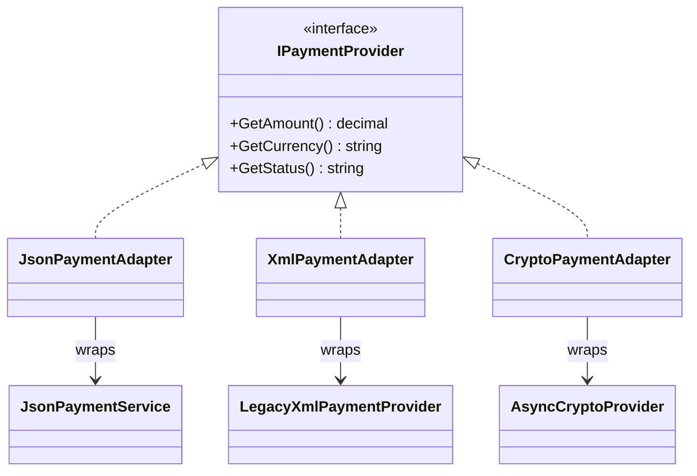
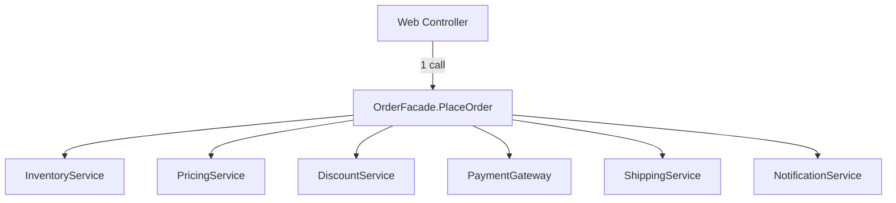
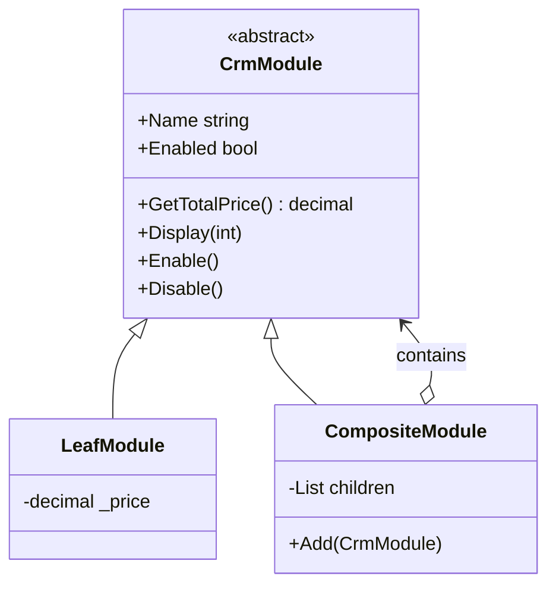
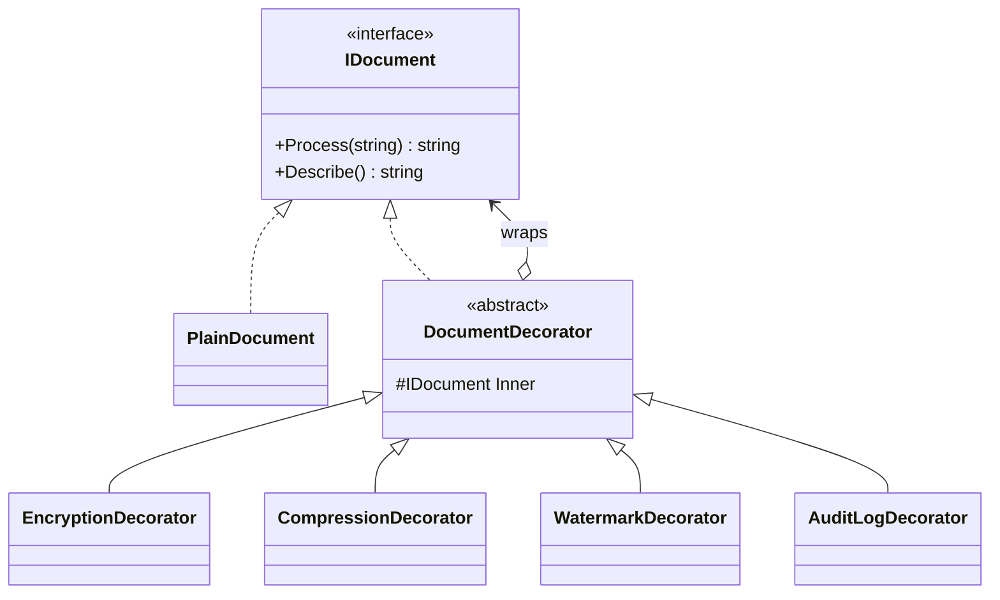
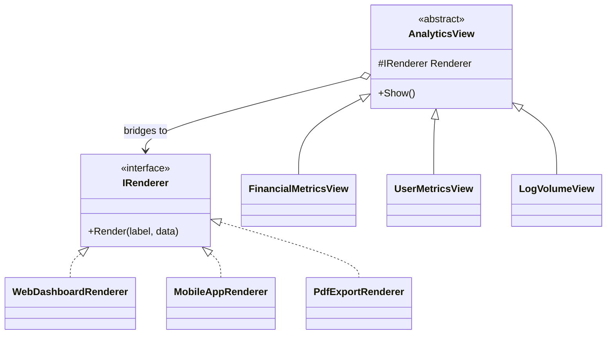
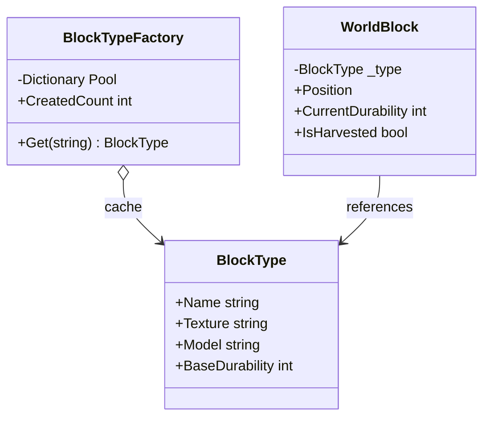

# 🏛 Лабораторна робота №3 — Структурні патерни

> [!abstract] 📋 Метадані
> **Курс**: Об'єктно-орієнтований аналіз та конструювання програмних систем
> **Семестр**: 2 (2025/26)
> **Студент**: Степаненко Назар Юрійович, ТВ-43
> **Дедлайн**: 7 квітня 2026 ✅
> **Мова реалізації**: C# (.NET 9)
> **Кількість патернів**: ==7 з 7== (всі структурні з каталогу GoF)
> **Код**: `OOA/LR/LR3/StructuralPatterns/`

## 🎯 Мета роботи

Для **7 бізнес-сценаріїв** обрати та реалізувати відповідний структурний патерн, обґрунтувати вибір, продемонструвати у консолі.

> [!info] Загальна ідея структурних патернів
> Структурні патерни ==організовують класи та об'єкти у більші структури==, не порушуючи інкапсуляції та забезпечуючи розширюваність.

---

## 🗺 Швидка карта

| № | Сценарій | Патерн | Що розв'язує |
|:-:|---|---|---|
| 1 | Уніфікація платіжних API | **Adapter** | Несумісні інтерфейси |
| 2 | Оформлення замовлення (6 підсистем) | **Facade** | Спрощення складної підсистеми |
| 3 | Lazy завантаження фільмів | **Proxy** | Заступник з контролем доступу |
| 4 | CRM-модулі з ієрархією | **Composite** | Робота з листям і деревом однаково |
| 5 | Документи з функціями | **Decorator** | Динамічне додавання поведінки |
| 6 | Аналітика × Відображення | **Bridge** | Розділення двох вимірів |
| 7 | Minecraft-світ | **Flyweight** | Економія пам'яті |

---

## 🔌 Завдання 1 — Adapter: Уніфікація платіжних API

> [!info] 📋 Сценарій
> Фінансова платформа інтегрована з ==трьома платіжними провайдерами==:
> - **JSON-провайдер** — поля `amount_value`, `currency_code`
> - **XML-провайдер** — XML payload, синхронний
> - **Crypto-провайдер** — асинхронний, з власними назвами методів
>
> Ядро системи очікує **єдиний інтерфейс** `IPaymentProvider`.

### 🎯 Чому **Adapter**

> [!tip] Класична задача "несумісні API → один контракт"
> Кожен сторонній сервіс ==загортається== у клас-адаптер, що реалізує `IPaymentProvider`. Ядро не знає про реальні провайдери.

### 📐 Структура



### 💡 Особливість — приховування async за sync API

```csharp
public sealed class CryptoPaymentAdapter : IPaymentProvider
{
    public CryptoPaymentAdapter(AsyncCryptoProvider provider, string txId)
    {
        // ⚡ Async-API ховається через .GetAwaiter().GetResult()
        var (price, ticker, ok) = provider
            .RetrieveTransactionAsync(txId)
            .GetAwaiter().GetResult();
        _amount   = price;
        _currency = ticker;
        _status   = ok;
    }
    public decimal GetAmount()   => _amount;
    public string  GetCurrency() => _currency;
    public string  GetStatus()   => _status;
}
```

> [!example] Adapter — це не лише про дані
> Crypto-adapter **приховує модель виконання** (async → sync). Тобто Adapter може адаптувати ==не лише структуру даних==, а й парадигму виклику.

---

## 🎭 Завдання 2 — Facade: Оформлення замовлення

> [!info] 📋 Сценарій
> У великому інтернет-магазині електроніки складна логіка замовлення: підрахунок вартості, знижки, склад, оплата, бронювання, доставка. Клієнтський код (веб-контролер) повинен оформляти ==одним викликом==.

### 🎯 Чому **Facade**

> [!tip] Один виклик замість координації 6 підсистем
> - Клієнт не знає **порядку** виклику.
> - Клієнт не знає про **залежності** між підсистемами.
> - Зміна `DiscountService` не торкається контролера.

### 📐 Структура — Facade приховує 6 підсистем



### 💡 Ключова ідея — оркестрація

```csharp
public OrderResult PlaceOrder(OrderRequest req)
{
    if (!_inventory.CheckAvailability(req.Products))
        throw new InvalidOperationException("Немає на складі");

    var subtotal = _pricing.CalculateTotal(req.Products);
    var total    = _discount.ApplyDiscount(subtotal, req.PromoCode);

    _inventory.Reserve(req.Products);
    var txId    = _payment.Charge(req.CardNumber, total);
    var trackId = _shipping.Schedule(req.ShippingAddress);
    _notification.NotifyCustomer(req.CustomerEmail, txId, trackId);

    return new OrderResult(txId, trackId, total);
}
```

> [!warning] Тонкий момент
> Facade ==НЕ блокує== прямого доступу до підсистем. Якщо клієнту потрібен лише `PricingService` — він може звернутися напряму. Facade — це **зручність**, а не обмеження.

### ⚠️ Ризики Facade

> [!warning] Facade може стати god object
> Якщо фасад занадто розростається — він втрачає сенс. Правило: **фасад має <10 методів** і кожен з них — це сценарій бізнесу, а не технічна деталь.

---

## 🪞 Завдання 3 — Proxy: Lazy завантаження фільмів

> [!info] 📋 Сценарій
> Стрімінгова платформа має каталог тисяч фільмів. Кожен фільм має ==важкі дані== (опис 1500 символів, акторський склад, рейтинги). Більшість користувачів ==переглядає лише список==. Преміум-фільми потребують перевірки доступу.

### 🎯 Чому **Proxy** — 3 ролі в одному класі

> [!tip] Mox-проксі: Virtual + Cache + Protection
> - **Virtual Proxy** — лінива ініціалізація `Movie` лише при зверненні до важких даних.
> - **Cache Proxy** — повторні звернення обслуговуються з `_cached`.
> - **Protection Proxy** — перевірка преміум-доступу.

### 💡 Реалізація

```csharp
public sealed class MovieProxy : IMovie
{
    private readonly string _title;
    private readonly bool   _isPremiumCatalog;
    private readonly bool   _userHasPremium;
    private Movie? _cached;

    private Movie Load()
    {
        // 🛡 Protection Proxy
        if (_isPremiumCatalog && !_userHasPremium)
            throw new UnauthorizedAccessException("Преміум-доступ потрібен");

        // 🐢 Virtual + 💾 Cache
        if (_cached is null)
            _cached = new Movie(_title, /* heavy data */ ...);
        else
            Console.WriteLine($"[Cache] '{_title}' з кеша");

        return _cached;
    }

    public string Title       => _title;                  // ⚡ легке — без Load()
    public string Description => Load().Description;      // 💎 важке — тригер Load()
    public string[] Cast      => Load().Cast;             // 💎 важке
    public double Rating      => Load().Rating;           // 💎 важке
}
```

### 🧪 Демонстрація

```
>> Користувач переглядає каталог (тільки назви):
   • Дюна: Частина третя             ← Title доступний одразу
   • Inception
   • Шеренга свободи [PREMIUM]
   
>> Користувач відкриває 'Inception':
   [MovieDB] *** ЗАВАНТАЖЕННЯ деталей фільму 'Inception' з бази *** ← Lazy load
   Опис: ...

>> Користувач повертається до 'Inception':
   [Cache] Деталі 'Inception' взято з кеша                          ← Cache hit

>> Користувач без підписки відкриває преміум-фільм:
   [BLOCKED] Фільм 'Шеренга свободи' доступний лише...              ← Protection block
```

### 🆚 Proxy vs Decorator vs Adapter

| Аспект | Adapter | Decorator | Proxy |
|---|---|---|---|
| Інтерфейс | ==Інший== | Той самий або розширений | ==Той самий== |
| Мета | З'єднати несумісні | Додати поведінку | Контролювати доступ |
| Динамічна вкладеність | ❌ | ✅ | ❌ |

---

## 🌳 Завдання 4 — Composite: CRM-модулі

> [!info] 📋 Сценарій
> CRM-система може складатися з базового ядра, модулів аналітики, інтеграцій з зовнішніми сервісами та розширень. ==Деякі модулі містять інші модулі==, утворюючи ієрархію. Система повинна однаково працювати як з окремим модулем, так і з групою.

### 🎯 Чому **Composite**

> [!tip] Listя і дерево — спільний інтерфейс
> Клас `LeafModule` (окремий модуль) і `CompositeModule` (група) обидва спадкують `CrmModule`. Клієнт викликає `crm.GetTotalPrice()` ==не знаючи==, листя це чи піддерево.

### 📐 Структура — ієрархія



### 💡 Каскадне вимкнення — суть Composite

```csharp
public sealed class CompositeModule : CrmModule
{
    private readonly List<CrmModule> _children = [];

    public override decimal GetTotalPrice() =>
        Enabled ? _children.Sum(c => c.GetTotalPrice()) : 0m;    // ↺ рекурсія

    public override void Disable()
    {
        base.Disable();
        foreach (var c in _children) c.Disable();                // ↺ каскад
    }
}
```

### 🧪 Демонстрація — вимкнення гілки

```
+ CRM-система  [сума: 63500 грн]
  • Базове ядро                     20000 грн
  + Модуль аналітики  [сума: 20500 грн]
    • Дашборди                         5000 грн
    • Звіти PDF/Excel                  3500 грн
    • Прогнози ML                     12000 грн
  + Розширення  [сума: 10000 грн]
    • Кастомний брендинг               4000 грн
    • Білі мітки                       6000 грн

>> Користувач вимикає всі 'Розширення':
+ CRM-система  [сума: 53500 грн]   ← знизилось на 10000
  ...
  + Розширення (вимкнено)  [сума: 0 грн]
    • Кастомний брендинг               4000 грн (вимкнено)
    • Білі мітки                       6000 грн (вимкнено)
```

---

## 🎁 Завдання 5 — Decorator: SaaS-документи

> [!info] 📋 Сценарій
> Користувач може завантажити документ і "==накрутити==" на нього функції: шифрування, стиснення, водяні знаки, логування доступу. **Комбінації довільні**, кількість функцій ==зростатиме== з часом.

### 🎯 Чому **Decorator** — врятувати від комбінаторного вибуху

> [!warning] Якщо використати спадкування
> 4 функції → ==2⁴ = 16 класів== комбінацій:
> - `EncryptedDocument`
> - `CompressedEncryptedDocument`
> - `WatermarkedCompressedEncryptedDocument`
> - ...
>
> 5 функцій → 32 класи. Безнадія.

> [!success] З Decorator: 4 функції = 4 класи
> Кожна функція — окремий декоратор. Комбінація — це **рекурсивна композиція**.

### 📐 Структура



### 💡 Композиція замість спадкування

```csharp
IDocument doc =
    new AuditLogDecorator(                            // 4-й шар
        new EncryptionDecorator(                      // 3-й шар
            new CompressionDecorator(                 // 2-й шар
                new WatermarkDecorator(               // 1-й шар
                    new PlainDocument("contract.docx"),  // ядро
                    "КОНФІДЕНЦІЙНО")),
            key: "AES-256"),
        user: "stepanenko@kpi.ua");

doc.Process(content);
```

> [!warning] Порядок ВАЖЛИВИЙ
> ==Шифрувати → стискати== дає поганий результат (зашифровані дані виглядають як випадкові, не стискаються).
> ==Стискати → шифрувати== — правильний порядок.
>
> Decorator не нав'язує порядок — це обов'язок клієнта.

---

## 🌉 Завдання 6 — Bridge: Аналітика × Відображення

> [!info] 📋 Сценарій
> Є ==3 типи даних== (фінансові показники, метрики користувачів, логи) і ==3 способи відображення== (веб-дашборд, мобільний додаток, PDF-експорт). Зараз кожна комбінація — окремий клас (3×3 = 9 класів), багато дублювання.

### 🎯 Чому **Bridge** — два незалежні виміри

> [!tip] Замість 9 класів — два виміри
> - Тип даних (Abstraction): 3 класи.
> - Спосіб відображення (Implementor): 3 класи.
> - **Разом: 6 класів** замість 9, з можливістю незалежного зростання.

### 📐 Структура — дві ієрархії



### 💡 Композиція двох вимірів

```csharp
AnalyticsView[] views =
[
    new FinancialMetricsView(new WebDashboardRenderer()),    // фінанси на вебі
    new UserMetricsView     (new MobileAppRenderer()),       // користувачі на мобілі
    new LogVolumeView       (new PdfExportRenderer()),       // логи в PDF
    new FinancialMetricsView(new PdfExportRenderer()),       // 🔁 повторне використання
];
```

### 🆚 Bridge vs Adapter

> [!example] Ключова відмінність — момент створення
> - **Adapter** проєктується ==постфактум==, щоб з'єднати несумісне.
> - **Bridge** проєктується ==заздалегідь==, для еволюції обох вимірів незалежно.

---

## 🪶 Завдання 7 — Flyweight: Minecraft-світ

> [!info] 📋 Сценарій
> Світ містить ==100 000+ блоків== (дуб, граніт, залізо). Кожен має текстуру, модель, базові властивості. Створювати їх копії для кожного блоку — ==overflow пам'яті==.

### 🎯 Чому **Flyweight** — розділення стану

> [!tip] Intrinsic vs Extrinsic
> - **Intrinsic** (спільний): текстура, модель, базова міцність. ==1 екземпляр на тип==.
> - **Extrinsic** (унікальний): позиція, поточна міцність, статус. ==N екземплярів==.

### 📐 Структура



### 💡 Фабрика-кеш — серце Flyweight

```csharp
public static class BlockTypeFactory
{
    private static readonly Dictionary<string, BlockType> Pool = new();

    public static BlockType Get(string name)
    {
        if (!Pool.TryGetValue(name, out var bt))         // 💾 шукаємо в кеші
        {
            bt = name switch                              // ➕ створюємо лише раз
            {
                "Дуб"    => new BlockType("Дуб",    "oak_planks_v2.png",  "tree_oak.obj",    60, true),
                "Граніт" => new BlockType("Граніт", "granite_diff.png",   "stone_block.obj", 200, false),
                // ...
            };
            Pool[name] = bt;
        }
        return bt;                                        // ⚡ повертаємо те саме посилання
    }
}
```

### 🧪 Результат економії

```
>> Створено блоків у світі:       100 000
>> Унікальних BlockType у пулі:   5
>> Економія: замість 100 000 копій важких текстур — лише 5
```

> [!success] Виграш
> Замість 100 000 копій текстур (×10 МБ кожна) === **~1 ТБ** у пам'яті, у нас 5 текстур = **50 МБ**. Економія в **20 000 разів**.

---

## 📊 Підсумкова таблиця

| Патерн | Класифікація | Коли застосовувати | Ключове |
|---|---|---|---|
| **Adapter** | Структурний | Несумісні API | Натягнути на існуючий контракт |
| **Facade** | Структурний | Складна підсистема | Простий вхід, складність схована |
| **Proxy** | Структурний | Контроль / lazy / cache | Той самий інтерфейс, контрольований доступ |
| **Composite** | Структурний | Дерево однорідних об'єктів | Листя і композит — спільний інтерфейс |
| **Decorator** | Структурний | Динамічні комбінації функцій | Рекурсивна композиція |
| **Bridge** | Структурний | Два виміри змінюваності | Дві ієрархії з мостом |
| **Flyweight** | Структурний | Мільйони об'єктів | Розділення intrinsic / extrinsic |

---

## 🎯 Висновок

> [!success]+ Результат лабораторної
> - Реалізовано **7 з 7** структурних патернів GoF.
> - Кожен на ==реальному бізнес-сценарії==.
> - У всіх реалізаціях дотримано принципів SOLID (передусім OCP і DIP).
> - **Композиція замість успадкування** — спільна риса більшості (Adapter, Bridge, Composite, Decorator, Facade, Proxy).
>
> Структурні патерни вирішують задачі ==організації класів та об'єктів у більші структури==, не порушуючи при цьому інкапсуляції та забезпечуючи розширюваність.

---

> [!info] 🔗 Пов'язані матеріали
> - [[Структурні патерни]] — детальний розбір
> - [[Теорія з лекцій#4. Структурні патерни]] — лекційний матеріал
> - [[Захист Лабораторних#5. ЛР3 — Структурні]] — шпаргалка захисту
> - [[ЛР2 — Породжувальні патерни|← ЛР2]] · [[ЛР4 — Поведінкові патерни|ЛР4 →]]
