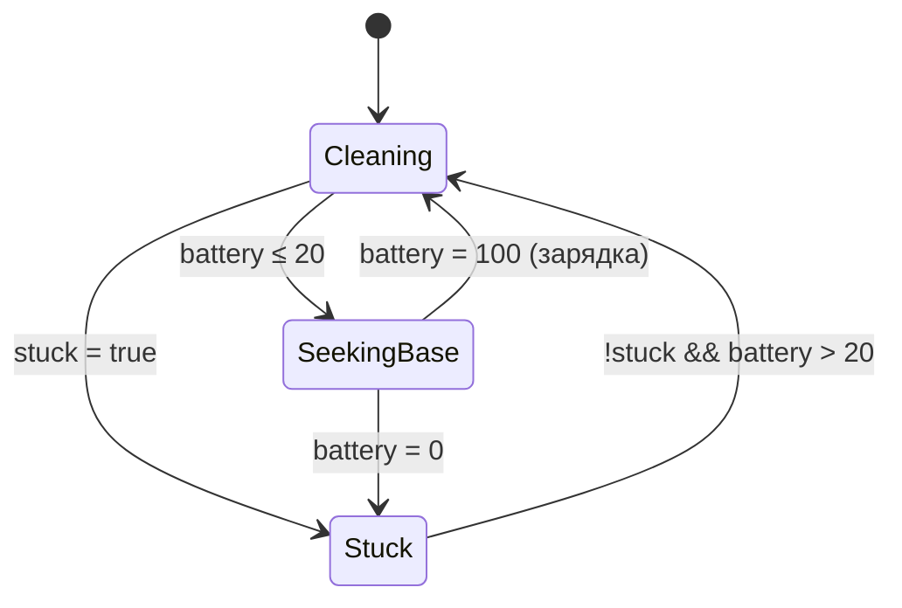
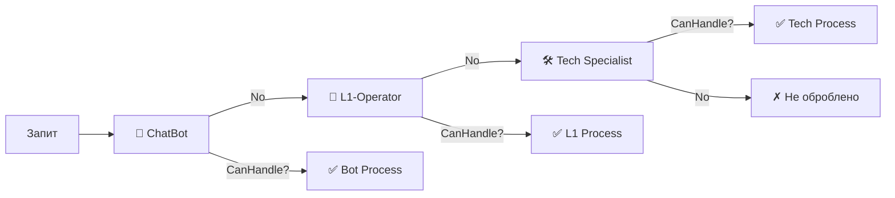
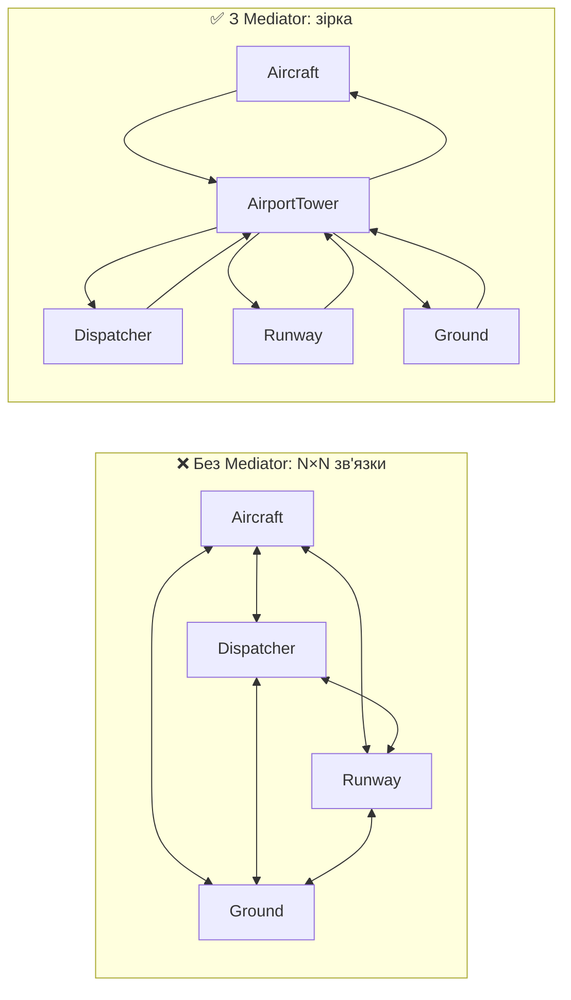
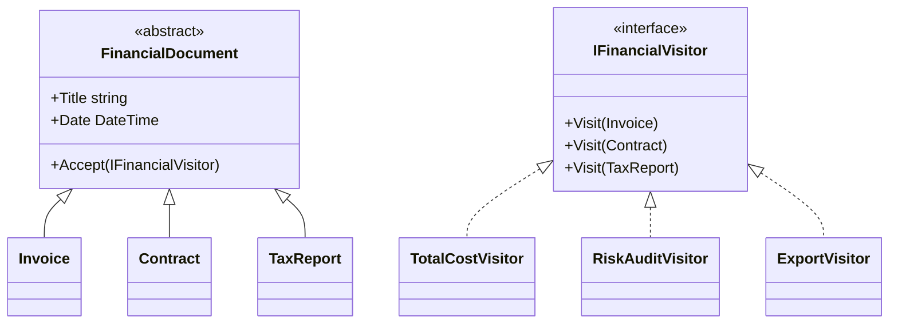

# 🎭 Лабораторна робота №4 — Поведінкові патерни

> [!abstract] 📋 Метадані
> **Курс**: Об'єктно-орієнтований аналіз та конструювання програмних систем
> **Семестр**: 2 (2025/26)
> **Студент**: Степаненко Назар Юрійович, ТВ-43
> **Дедлайн**: 12 травня 2026 ✅
> **Мова реалізації**: C# (.NET 9)
> **Кількість патернів**: ==10 з 11== (всі поведінкові крім Interpreter)
> **Код**: `OOA/LR/LR4/BehavioralPatterns/`

## 🎯 Мета роботи

Для **10 бізнес-сценаріїв** обрати та реалізувати відповідний поведінковий патерн, обґрунтувати вибір, продемонструвати у консолі.

> [!info] Загальна ідея поведінкових патернів
> Поведінкові патерни стосуються ==взаємодії та комунікації об'єктів== — як вони обмінюються повідомленнями, розподіляють обов'язки, координують роботу.

---

## 🗺 Швидка карта

| № | Сценарій | Патерн | Ключова ідея |
|:-:|---|---|---|
| 1 | YouTube підписки | **Observer** | 1 → багато слухачів |
| 2 | Кошик з різною оплатою | **Strategy** | Алгоритм як об'єкт |
| 3 | Робот-пилосос | **State** | Поведінка зі станом |
| 4 | Текстовий редактор + Ctrl+Z | **Memento** | Знімок без втрати інкапсуляції |
| 5 | Підтримка користувачів | **Chain of Responsibility** | Ланцюг обробників |
| 6 | Онлайн-курси | **Template Method** | Алгоритм + варіативні кроки |
| 7 | Документообіг + undo | **Command** | Дія як об'єкт |
| 8 | HRM-система | **Iterator** | Уніфікований обхід |
| 9 | Авіадиспетчер | **Mediator** | Централізована координація |
| 10 | Аудит фінансових документів | **Visitor** | Операції окремо від елементів |

---

## 👀 Завдання 1 — Observer: YouTube

> [!info] 📋 Сценарій
> Автор викладає нове відео, ==всі підписники== повинні отримати сповіщення. Автор **не знає особисто** кожного підписника.

### 💡 Реалізація

```csharp
channel.Subscribe(alice);                  // Email
channel.Subscribe(bob);                    // Push
channel.UploadVideo("Як працюють патерни");
// → Email до Аліси
// → Push до Богдана
```

> [!tip] Ключове
> Канал тримає `List<ISubscriber>` і поліморфно викликає `OnNewVideo()`. ==Він не знає==, Email чи Push підписник.

### ⚠️ Тонкий момент

> [!warning] Порядок сповіщення
> Підписники отримують повідомлення у ==випадковій послідовності== (порядок додавання в List). Якщо потрібен пріоритет — використовуй `PriorityQueue`.

---

## 💳 Завдання 2 — Strategy: Способи оплати кошика

> [!info] 📋 Сценарій
> Користувач обирає PayPal, Кредитну картку або Криптовалюту. ==Без великого `switch`== — кошик просто викликає `Pay()`.

### 💡 Реалізація — нуль `switch`

```csharp
IPaymentStrategy[] strategies =
[
    new PayPalStrategy    ("nazar@kpi.ua"),
    new CreditCardStrategy("4149 4393 1234 5678", "STEPANENKO N."),
    new CryptoStrategy    ("0xC4F3B4B3D1FFAA2B3E", "ETH"),
];

foreach (var s in strategies)
{
    var cart = new ShoppingCart();
    cart.Add("Книга 'Чистий код'", 850);
    cart.Add("Мишка ігрова", 1450);
    cart.Checkout(s);                      // ← поліморфний виклик
}
```

### 🆚 Strategy vs State (важливо для захисту!)

> [!important] Структурно схожі — семантично різні
> - **Strategy** обирає клієнт ==ЗОВНІ==: "я хочу платити карткою".
> - **State** обирає сам об'єкт ==ВСЕРЕДИНІ==: "батарея сіла → шукаю док".

---

## 🔄 Завдання 3 — State: Робот-пилосос

> [!info] 📋 Сценарій
> Робот діє по-різному залежно від батареї / застрягання:
> - Батарея повна → ==прибирає==
> - Батарея низька → ==шукає базу==
> - Застряг → ==пищить==
>
> Замість купи `if (battery < 10)` — машина станів.

### 📐 Діаграма станів



### 💡 Делегування у клас-стан

```csharp
public sealed class CleaningState : IVacuumState
{
    public string Name => "ПРИБИРАННЯ";

    public void Tick(VacuumRobot robot)
    {
        robot.Battery -= 8;
        Console.WriteLine($"     [Clean]   жжжж... батарея={robot.Battery}%");

        if (robot.Stuck)              robot.SetState(new StuckState());
        else if (robot.Battery <= 20) robot.SetState(new SeekingBaseState());
    }
}
```

> [!success] У VacuumRobot нуль `if`
> Контекст просто делегує: `_state.Tick(this)`. Уся логіка переходів — ==у самих станах==.

---

## ⏮ Завдання 4 — Memento: Текстовий редактор з Ctrl+Z

> [!info] 📋 Сценарій
> Користувач вводить текст, видаляє, змінює колір. Ctrl+Z повертає до попереднього стану ==не порушуючи інкапсуляцію==.

### 🎯 Ключове — `internal` доступ

```csharp
public sealed class EditorMemento
{
    internal string Text  { get; }        // 🔐 internal — лише TextEditor бачить
    internal string Color { get; }        // 🔐 internal
    internal DateTime CreatedAt { get; }

    internal EditorMemento(string text, string color)
    {
        Text = text; Color = color; CreatedAt = DateTime.Now;
    }
}
```

> [!success] Інкапсуляція збережена
> - `History` (Caretaker) ==зберігає== memento в стеку.
> - `History` ==НЕ може прочитати== Text або Color (вони `internal`).
> - Лише `TextEditor.Restore()` (той самий assembly) має доступ.

### 💡 Demo

```
✎ ввід: 'Привіт, '   стан: "Привіт, " [чорний]
✎ ввід: 'світ!'      стан: "Привіт, світ!" [чорний]
✦ колір → синій       стан: "Привіт, світ!" [синій]
✎ ввід: ' Як справи?' стан: "Привіт, світ! Як справи?" [синій]
⌫ видалено 11 симв.    стан: "Привіт, світ!" [синій]
✦ колір → червоний    стан: "Привіт, світ!" [червоний]

>> Ctrl+Z × 3:
↶ undo стан: "Привіт, світ!" [синій]
↶ undo стан: "Привіт, світ! Як справи?" [синій]
↶ undo стан: "Привіт, світ!" [синій]
```

---

## ⛓ Завдання 5 — Chain of Responsibility: Підтримка

> [!info] 📋 Сценарій
> Користувач пише запит у підтримку. Спочатку — Чат-бот. Якщо не знає — передає L1-оператору. Якщо той не справляється — техспеціалісту.

### 📐 Ланцюг



### 💡 Fluent setup

```csharp
var bot  = new ChatBotHandler();
var l1   = new L1OperatorHandler();
var tech = new TechSpecialistHandler();

bot.SetNext(l1).SetNext(tech);            // ⛓ ланцюг побудовано fluent-методами
bot.Handle(request);
```

> [!warning] Граничний випадок
> Якщо запит не оброблено жодним handler — ==це не помилка==, а легітимний результат. Програма логує "Ніхто не зміг" і йде далі.

---

## 📋 Завдання 6 — Template Method: Онлайн-курси

> [!info] 📋 Сценарій
> Курси (програмування, дизайн, менеджмент) проходяться у спільній послідовності: ==лекції → практика → тести → захист==. Але деякі курси мають ==специфічні етапи== (програмування — автоматична перевірка, дизайн — презентація макета).

### 💡 Скелет алгоритму у базовому класі

```csharp
public abstract class OnlineCourse
{
    // 📋 Template Method — структура алгоритму
    public void Complete()
    {
        Console.WriteLine($"  >> Старт курсу '{Name}'");
        WatchLectures();          // 🔒 спільний
        DoExercises();            // 🔒 спільний
        ExtraVerificationStep();  // 🪝 hook — опціональний
        TakeQuiz();               // 🔒 спільний
        DefendFinalProject();     // 🪝 abstract — обов'язковий
        Console.WriteLine($"  >> Курс '{Name}' завершено");
    }

    protected virtual void ExtraVerificationStep() { /* hook */ }
    protected abstract void DefendFinalProject();
}
```

### 📐 Конкретні курси переозначають кроки

| Курс | ExtraVerificationStep | DefendFinalProject |
|---|---|---|
| **ProgrammingCourse** | 🤖 Автоматична перевірка коду | 💻 GitHub-PR + рев'ю |
| **DesignCourse** | 🎨 Презентація макета | 🖼 Захист макета у Figma |
| **ManagementCourse** | (не переозначає — hook порожній) | 📋 Захист стратегії |

> [!quote] **Hollywood Principle**
> "Don't call us — we'll call you". Підклас ==не керує== потоком, а лише надає окремі кроки.

---

## ✋ Завдання 7 — Command: Документообіг з undo

> [!info] 📋 Сценарій
> У корпоративній системі документообігу кожна дія (Create / Update / Delete) повинна:
> - виконуватися,
> - ==логуватися==,
> - ==скасовуватися== (undo).

### 💡 Дія як об'єкт + undo

```csharp
public interface IDocumentCommand
{
    void Execute();
    void Undo();
}

public sealed class DeleteDocumentCommand : IDocumentCommand
{
    private readonly DocumentRepository _repo;
    private readonly int _id;
    private string _backup = string.Empty;       // 💾 збережено для undo

    public void Execute() => _repo.Delete(_id, out _backup);

    public void Undo()
    {
        _repo.Restore(_id, _backup);             // ↶ повертає що видалив
    }
}
```

### 🧪 Демонстрація — 4 дії + 3 undo

```
>> Виконую: CREATE «Договір №1 з ТО…»
>> Виконую: CREATE «Договір №2 з ТО…»
>> Виконую: UPDATE #1
>> Виконую: DELETE #2
   Документів у репо: 1

>> Скасовую: DELETE #2  → відновлено #2
>> Скасовую: UPDATE #1  → повернуто старий вміст
>> Скасовую: CREATE «Договір №2…»  → видалено #2
   Документів у репо після undo: 1
```

### ✨ Командний invoker зі стеком

```csharp
public sealed class DocumentCommandInvoker
{
    private readonly Stack<IDocumentCommand> _executed = new();

    public void Execute(IDocumentCommand cmd)
    {
        cmd.Execute();
        _executed.Push(cmd);                  // 📚 в історію
    }

    public void UndoLast() => _executed.Pop().Undo();    // ⏮ Ctrl+Z
}
```

---

## 🔄 Завдання 8 — Iterator: HRM-система

> [!info] 📋 Сценарій
> У HRM-системі ==тисячі співробітників== у різних структурах:
> - Відділи — як `List<Employee>`
> - Проєктні команди — як `Dictionary<role, List<Employee>>`
> - Адмін-група — як простий `List<Employee>`
>
> Клієнт повинен ==однаково обходити всіх==.

### 💡 Сила `yield return`

```csharp
public sealed class ProjectTeam : IEnumerable<Employee>
{
    private readonly Dictionary<string, List<Employee>> _byRole = new();

    public IEnumerator<Employee> GetEnumerator()
    {
        foreach (var role in _byRole.Keys.OrderBy(k => k))
            foreach (var e in _byRole[role])
                yield return e;            // ⚡ lazy iterator з state machine
    }
}
```

### 💎 Composite Iterator

```csharp
var company = new CompanyEmployees()
    .Include(rnd)         // Department (List)
    .Include(team)        // ProjectTeam (Dictionary)
    .Include(adminGroup); // List

foreach (var e in company)
    Console.WriteLine($"  • {e.FullName,-16} | {e.Role,-13}");
// Клієнт НЕ знає внутрішньої структури кожного джерела!
```

> [!tip] LINQ — це Iterator pattern
> `EmployeeIterators.OnlyActive(source)` через `yield return` — фактично `source.Where(e => e.Active)`. LINQ під капотом використовує Iterator.

---

## 🏢 Завдання 9 — Mediator: Авіадиспетчер

> [!info] 📋 Сценарій
> В аеропорту одночасно: ==літаки, диспетчер, наземні служби, смуги==. Якщо кожен літак напряму взаємодіє з усіма — система некерована.

### 📐 До і після Mediator



### 💡 Зведення зв'язків до зірки

```csharp
var tower = new AirportTowerMediator();
tower.Register(aircraft);
tower.Register(dispatcher);
tower.Register(runway);
tower.Register(ground);

aircraft.RequestLanding();   // → tower маршрутизує між учасниками
```

> [!warning] У моїй реалізації — broadcast
> Усі учасники отримують повідомлення, але реагують лише на свої. У продакшені — targeted routing. Broadcast більш чесно демонструє ==decoupling== — колеги не знають один одного.

---

## 🏛 Завдання 10 — Visitor: Аудит фінансових документів

> [!info] 📋 Сценарій
> Документи (Invoice / Contract / TaxReport) — структура ==СТАБІЛЬНА==. Операції (Total / Audit / Export / Profitability) — змінюються ==ЧАСТО==. Не хочемо засмічувати класи документів усіма операціями.

### 🎯 Чому Visitor

> [!tip] Подвійна диспетчеризація (double dispatch)
> ```csharp
> public override void Accept(IFinancialVisitor v) => v.Visit(this);
> //                                                    ─────── ──── 
> //                                              vis-тип   element-тип
> ```
> `Accept(v)` вибирає метод за **типом visitor-а**, потім `v.Visit(this)` вибирає перевантажений метод за **фактичним типом документа**. Це і є double dispatch.

### 📐 Структура



### 💡 3 операції над одними і тими ж документами

```csharp
FinancialDocument[] documents = [ invoice1, contract1, taxReport, invoice2, contract2 ];

// Операція 1: підрахунок
var totalizer = new TotalCostVisitor();
foreach (var d in documents) d.Accept(totalizer);
Console.WriteLine($"Підсумок: {totalizer.Total} грн");          // ▶ 1 807 900 грн

// Операція 2: аудит ризиків
var auditor = new RiskAuditVisitor();
foreach (var d in documents) d.Accept(auditor);
foreach (var risk in auditor.Risks) Console.WriteLine($"⚠ {risk}");
// ▶ ⚠ Контракт KPI-А — 36 міс. (довгий)
// ▶ ⚠ Інвойс #1025 — > 100k грн

// Операція 3: XML-експорт
var exporter = new ExportVisitor();
foreach (var d in documents) d.Accept(exporter);
```

### ⚖️ Платежа за Visitor

> [!warning] Tradeoff Visitor-у
> - ✅ **Нова операція** = новий visitor (БЕЗ зміни класів-документів).
> - ❌ **Новий тип документа** = змінити ВСІ visitor-и (додати `Visit(NewDoc)`).
>
> Тому Visitor підходить, ==коли структура стабільна==, а операції — мінливі. Якщо навпаки — використовуй віртуальні методи у самих документах.

---

## 📊 Підсумкова таблиця

| Патерн | Класифікація | Ключова ідея |
|---|---|---|
| **Observer** | Поведінковий | Підписка + автоматичні сповіщення |
| **Strategy** | Поведінковий | Заміна `switch` на поліморфізм |
| **State** | Поведінковий | Поведінка делегується класу-стану |
| **Memento** | Поведінковий | Знімок з `internal`-полями |
| **Chain of Responsibility** | Поведінковий | Ланцюг обробників |
| **Template Method** | Поведінковий | Скелет алгоритму + hooks |
| **Command** | Поведінковий | Дія = об'єкт + undo через стек |
| **Iterator** | Поведінковий | Уніфікований обхід через `yield` |
| **Mediator** | Поведінковий | N×N → зірка через посередника |
| **Visitor** | Поведінковий | Операції окремо від елементів (double dispatch) |

---

## 🆚 Топ-5 пар патернів для захисту

> [!important] Найчастіші питання "у чому різниця між Х і Y"

| Пара | Структурно | Семантично |
|---|---|---|
| **Strategy** vs **State** | Однакова | Strategy обирає клієнт; State обирає сам об'єкт |
| **Observer** vs **Mediator** | Один-до-багатьох vs багато-до-багатьох | Observer = шина сповіщень; Mediator = розумний хаб |
| **Command** vs **Strategy** | Обидва — алгоритм як об'єкт | Command має `Execute() + Undo() + stateful`; Strategy зазвичай stateless |
| **Iterator** vs **Visitor** | Iterator — обходить, Visitor — оперує | Часто комбінуються |
| **Chain of Resp.** vs **Mediator** | Обидва — про маршрутизацію | Chain — лінійний прохід; Mediator — центральний хаб |

---

## 🎯 Висновок

> [!success]+ Результат лабораторної
> - Реалізовано **10 з 11** поведінкових патернів GoF (всі крім Interpreter — не входив у завдання).
> - Кожен на ==реальному бізнес-сценарії==.
> - Послідовно застосовано принципи SOLID — особливо ==SRP== (один клас — одна відповідальність), ==OCP== (нові поведінки без зміни існуючого) та ==DIP== (залежність від абстракцій).
> - Поведінкові патерни вирішують задачі **взаємодії об'єктів та розподілу обов'язків**.
>
> Загалом по всіх 4 ЛР: **22 з 23** патернів GoF + 4 виправлення SOLID + повний теоретичний конспект.

---

> [!info] 🔗 Пов'язані матеріали
> - [[Поведінкові патерни]] — детальний розбір
> - [[Теорія з лекцій#5. Поведінкові патерни]] — лекційний матеріал
> - [[Захист Лабораторних#6. ЛР4 — Поведінкові]] — шпаргалка захисту
> - [[ЛР3 — Структурні патерни|← ЛР3]] · [[README|🏠 Конспект]]
